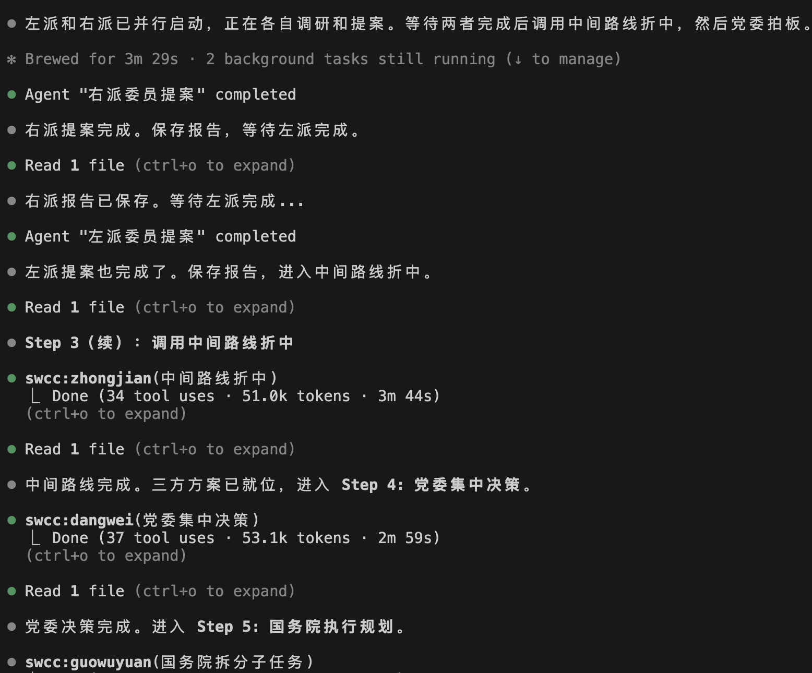
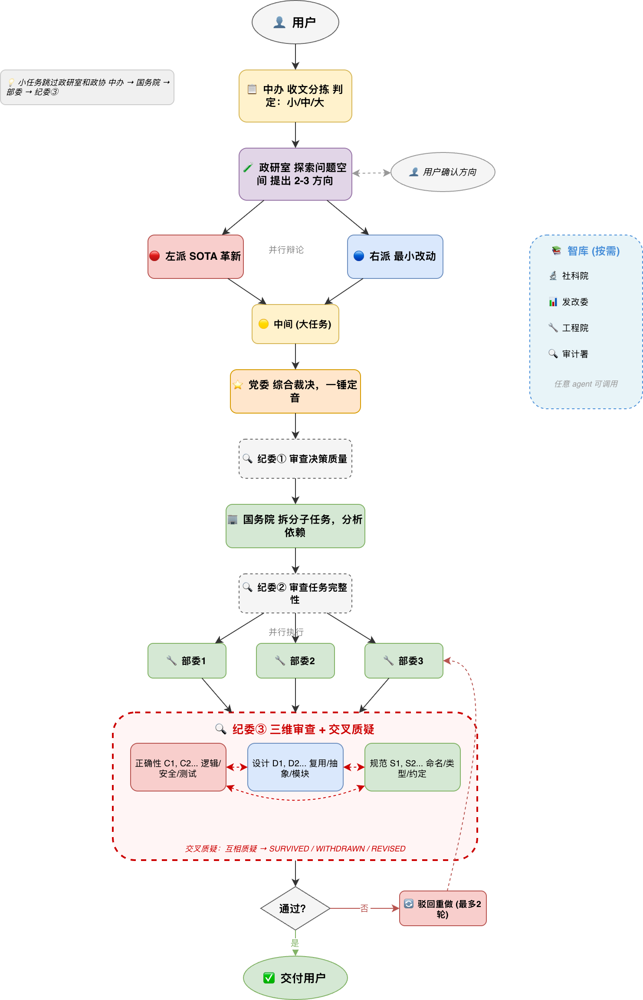

<p align="center">
  <h1 align="center">🇨🇳 SWCC</h1>
  <p align="center"><b>Socialism With Chinese Characteristics — SW Claude Code</b></p>
  <p align="center">民主集中制多智能体编排 Claude Code 插件</p>
</p>

<p align="center">
  
  
  
  
  
  
</p>

---

> **美国人用三权分立编排 AI，中国古人用三省六部编排 AI，我们用什么？**
>
> 1949 年之后的答案：**民主集中制**。
>
> 政研室摸底，左派右派吵，党委拍板，纪委审决策，国务院拆活儿，纪委审任务，部委干活儿，三路纪委交叉验收。
>
> 一个编码任务，走完一整套中国特色社会主义政治流程。

## 为什么是民主集中制？

大多数 Multi-Agent 框架的思路是：让 Agent 自由协作，出了问题再修。

这就像没有制度的团队——要么一团和气（所有 Agent 都同意，没人提反对意见），要么各说各的（Agent 之间矛盾无人裁决）。

民主集中制的解法：**先摸底调研，再强制对立，最后集中拍板**。政研室先探索问题空间、暴露模糊点；左派和右派必须提出不同方案，暴露盲区；党委综合裁决，一锤定音；纪委在决策后、任务拆分后、代码执行后三次介入审查；部委坚决执行，三路纪委交叉质疑验收。

| | SWCC 🇨🇳 | directive 🇺🇸 | edict 🏯 |
|---|:---:|:---:|:---:|
| **灵感来源** | 中国特色社会主义 | 美国宪政 | 三省六部 |
| **运行方式** | ✅ Claude Code 插件，装上即用 | 独立应用，需 Docker | 独立应用，需 Docker + OpenClaw |
| **决策机制** | 民主集中制 | 三权制衡 | 层级审批 |
| **前期调研** | ✅ 政研室探索问题空间 | ❌ | ❌ |
| **强制对立** | ✅ 左右必须提出不同方案 | ❌ | ❌ |
| **动态流程** | ✅ 按规模自动调节协商深度 | ❌ 固定流程 | ❌ 固定流程 |
| **冲突裁决** | 党委综合裁决 | 最高法院仲裁 | 门下省封驳 |
| **代码执行** | ✅ 部委执行 | ✅ DoD 执行 | ✅ 兵部执行 |
| **按需调研** | ✅ 智库四重身份（社科院/发改委/工程院/审计署） | ❌ | ❌ |
| **代码验收** | ✅ 三维纪委（正确性/设计/规范）+ 交叉质疑 | ✅ Senate + DoJ 审查 | ⚠️ 门下省审计划 |
| **紧急通道** | ✅ 举国体制 | ❌ | ❌ |

## 30 秒体验

```bash
# 安装
claude plugins marketplace add ylxmf2005/swcc
claude plugins install swcc

# 在任意项目中
/zhili 给这个项目加 JWT 认证
```

坐好，看戏。

<p align="center">
  
</p>

## 🏛️ 全流程工作流

<p align="center">
  
</p>

> 💡 小任务跳过政研室和政协，直接：中办 → 国务院 → 部委 → 纪委③

## 🎭 十大员

| Agent | 角色 | 信条 | 阶段 |
|-------|------|------|------|
| 📋 zhongban (中办) | 收文分拣 | "宁大勿小，多协商总比少协商好" | 入口 |
| 🧪 zhengyanshi (政研室) | 前期调研 | "先把问题搞清楚，再让人辩论" | 调研 |
| 🔴 zuopai (政协左派) | 激进革新 | "推倒重来！旧代码就该删掉重写！" | 协商 |
| 🔵 youpai (政协右派) | 保守稳健 | "能修补绝不重写，能复用绝不新建" | 协商 |
| 🟡 zhongjian (政协中间) | 折中调和 | "实践是检验真理的唯一标准" | 协商 |
| ⭐ dangwei (党委) | 最终裁决 | "批评左倾冒险主义，纠正右倾保守主义" | 决策 |
| 🏢 guowuyuan (国务院) | 拆分调度 | "党委决策不可更改，我只负责拆分" | 规划 |
| 🔧 buwei (部委) | 代码执行 | "令行禁止——不多做，不少做" | 执行 |
| 🔍 jiwei (纪委) | 三维监察 | "铁面无私——正确性、设计、规范，三路交叉质疑" | 审查 |
| 📚 zhiku (智库) | 按需调研 | "没有调查就没有发言权" | 全程 |

> 💡 **政研室**在中办分拣后、政协协商前介入——探索问题空间、提出方向选项、与用户确认方向，让后续辩论有的放矢。
>
> 💡 **智库**不在主流程中，而是被其他 agent 按需调用。它有四重身份：**社科院**（战略调研）、**发改委**（可行性分析）、**工程院**（实操参考）、**审计署**（合规标准），根据调用方的需求自动切换。


## 🔍 纪委三次介入

纪委不是只在最后验收——它在流程中三次介入，覆盖从决策到执行的全链路：

| 介入点 | 位置 | 检查什么 | 产物 |
|--------|------|---------|------|
| 纪委① | 党委决策后 | 决策是否有据可依、回应了各方观点、不超范围 | `jiwei-xunshi-1.md` |
| 纪委② | 国务院拆分后 | 任务是否完整覆盖决策、无遗漏、依赖合理 | `jiwei-xunshi-2.md` |
| 纪委③ | 部委执行后 | 三维并行审查 + 交叉质疑（见下） | `jiwei-final-*.md` |

### 纪委③ 三维审查机制

3 个纪委专项独立审查后交叉质疑：

| 专项 | 编号前缀 | 关注点 |
|------|---------|--------|
| **正确性** | C1, C2... | 逻辑错误、安全漏洞、边界条件、竞态、执行一致性 + 运行自动化测试 |
| **设计** | D1, D2... | 代码重复、本地/外部复用、抽象合理性、模块职责 |
| **规范** | S1, S2... | 命名规范、类型安全、魔数、commit 卫生、项目约定 |

**交叉质疑**：三个专项独立产出发现后，每个纪委**必须质疑至少一条**其他专项的发现。被质疑方必须辩护或撤回。最终每条发现标注 SURVIVED / WITHDRAWN / REVISED。

任何一个专项驳回，整体即为驳回。

## 📊 动态协商深度

中办会根据任务复杂度自动决定协商深度。你也可以用 `--scale` 覆盖：

```
/zhili --scale 小 fix typo in README        → 跳过调研和协商，直接执行
/zhili add input validation                  → 中办自动判定
/zhili --scale 大 redesign the auth system   → 强制三方协商
```

| 规模 | 协商深度 | 纪委介入 | 判定标准 |
|------|---------|---------|---------|
| 小 | 跳过政研室和协商 | 仅纪委③ | <3 文件，简单改动 |
| 中 | 🧪政研室 → 🔴左派 vs 🔵右派 | 纪委①②③ | 3-8 文件，中等复杂度 |
| 大 | 🧪政研室 → 🔴左派 vs 🔵右派 → 🟡中间 | 纪委①②③ | >8 文件或架构级变更 |

## ⚡ 举国体制 (`/juguo`)

当任务紧急到没时间开会：

```
/juguo 紧急修复认证漏洞
```

> 跳过中办。跳过政研室。跳过政协。跳过党委。国务院直接拆活，全部委同时开干，纪委只跑自动化。
>
> 集中力量办大事。

## 🛠️ 七大技能

| 技能 | 说明 | 用法 |
|------|------|------|
| `/zhili` | **全流程一条龙** — 从调研到交付 | `/zhili [--scale 小\|中\|大] 任务描述` |
| `/xieshang` | **只看方案** — 产出计划不动代码 | `/xieshang 任务描述` |
| `/zhixing` | **直接执行** — 跳过讨论 | `/zhixing [方案]` |
| `/zhengyanshi` | **前期调研** — 探索问题空间、确认方向 | `/zhengyanshi 任务描述` |
| `/jicha` | **纪委审查** — review 当前变更 | `/jicha [关注点]` |
| `/juguo` | **举国体制** — 全力冲刺 | `/juguo 任务描述` |
| `/zhiku` | **智库调研** — 按需研究任意问题 | `/zhiku 调研问题` |

> 💡 **每个技能都可以单独使用。** 不一定要走全流程——想调研就 `/zhiku`，想只看方案就 `/xieshang`，想直接干就 `/zhixing`，想 review 就 `/jicha`，想先探索问题就 `/zhengyanshi`。按需组合，灵活使用。

## 📦 安装

```bash
# 方式一：从 GitHub 安装
claude plugins marketplace add ylxmf2005/swcc
claude plugins install swcc

# 方式二：本地安装
git clone https://github.com/ylxmf2005/swcc.git
claude plugins install --path ./swcc
```

零依赖。不需要 Python，不需要 Docker，不需要 OpenClaw。装上就用。

## 📁 产物

每次运行按日期+任务关键词创建独立目录，完整可追溯：

```
.tmp/swcc/
└── 2026-03-10-add-user-auth/          # 日期-任务slug
    ├── zhongban-report.md             # 📋 中办分拣报告
    ├── zhengyanshi-report.md          # 🧪 政研室调研报告
    ├── user-direction.md              # 👤 用户确认的方向（如有反馈）
    ├── zuopai-proposal.md             # 🔴 左派方案（含 diff 草案）
    ├── youpai-proposal.md             # 🔵 右派方案（含 diff 草案）
    ├── zhongjian-proposal.md          # 🟡 中间路线方案（大任务时）
    ├── dangwei-decision.md            # ⭐ 党委最终决策
    ├── jiwei-xunshi-1.md              # 🔍 纪委决策审查
    ├── guowuyuan-tasks.md             # 🏢 国务院子任务清单
    ├── jiwei-xunshi-2.md              # 🔍 纪委任务审查
    ├── buwei-{N}-result.md            # 🔧 各部委执行报告
    ├── jiwei-verdict-correctness.md   # 🔍 正确性专项审查
    ├── jiwei-verdict-design.md        # 🔍 设计专项审查
    ├── jiwei-verdict-standards.md     # 🔍 规范专项审查
    ├── jiwei-final-correctness.md     # 🔍 正确性交叉质疑终稿
    ├── jiwei-final-design.md          # 🔍 设计交叉质疑终稿
    ├── jiwei-final-standards.md       # 🔍 规范交叉质疑终稿
    └── zhiku-report.md                # 📚 智库调研报告（按需）
```

## 🤔 FAQ

**Q: 这是认真的吗？**

A: 隐喻不是装饰，它就是架构。LLM 天然倾向附和——让两个 agent "自由讨论"，它们会迅速达成一致，盲区没人暴露。民主集中制直接解决这个问题：左派 system prompt 写死了"研究 SOTA、推倒重来"，右派写死了"复用现有、最小改动"。党委拿到的不是一个方案和一堆"我同意"，而是路线对立的具体方案各自带着 diff 和风险分析。对抗性辩论在法律（控辩）、学术（peer review）、军事（红蓝对抗）中都已验证，我们只是用政治隐喻命名了角色。

**Q: 所有 agent 都是同一个模型，"左右辩论"不是自己跟自己吵吗？**

A: 同一个模型 + 不同约束 = 不同输出。左派的工作流是搜索业界最佳实践再提革新方案，右派是摸清现有可复用资产再提最小改动。它们读的代码不同、搜索的东西不同、评估的维度不同。价值不在于"观点"，而在于强制搜索束覆盖更大的解空间——一个 agent 探索一条路径，两个对立 agent 至少探索两条。

**Q: 和 directive（美国宪政）、edict（三省六部）的核心区别？**

A: 三个框架都做全流程（规划→执行→审查）。区别在决策前：directive 的 NSC 独自规划，Senate 只能批准或否决；edict 的中书省独自规划，门下省只能驳回。审查都是二元的（行不行？）。SWCC 的协商是生成式的（有没有更好的方案？）——左右两派必须提出结构性不同的完整方案，党委综合裁决。驳回烂方案容易，但驳回之后还是同一个 agent 改一改再交——不如一开始就把不同路线摆上桌。

**Q: 如果党委做了错误的决策怎么办？**

A: 多层防线。首先政研室在协商前就探索了问题空间、暴露了模糊点；然后对抗性协商让党委看到多个立场对立的方案；决策后纪委立即审查决策质量；国务院拆任务后纪委再审查任务完整性。即便到了执行阶段，三路纪委（正确性/设计/规范）独立审查后还要交叉质疑——每个纪委必须质疑至少一条其他纪委的发现，防止橡皮图章。驳回后自动重试最多 2 轮，之后交人工。所有中间产物（`.tmp/swcc/`）完整保留，可以定位哪个环节出了问题。

**Q: token 消耗大吗？**

A: 小任务跳过调研和辩论（4-5 次 agent 调用），中任务加政研室、左右辩论、党委和三维纪委审查（12-15 次），大任务再加中间路线（14-17 次）。比单 agent 贵——三路纪委交叉质疑是主要增量。但一次错误的架构决策导致 debug 两小时，成本远超 10 分钟的 LLM 辩论。任务明确不需要讨论就用 `/juguo` 跳过所有协商直接干。

## Contributing

PRs welcome. 无论你是左派还是右派，我们都欢迎。

## License

MIT — 比任何政治制度都自由。
